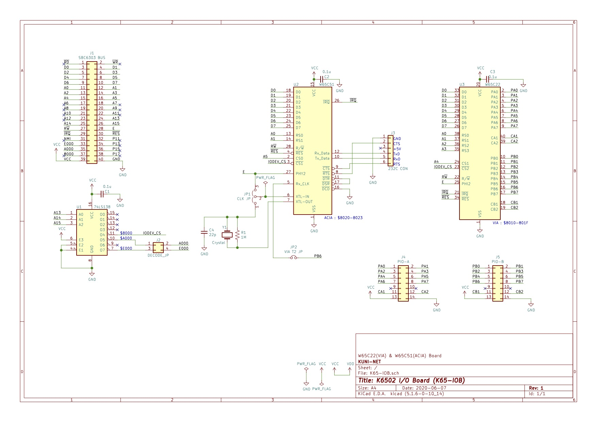

# 6502マイコン用 I/Oボード

## 概要
- 6502マイコンやSBC68系バスへ接続可能なI/Oボードです。
  - lite版は CPUボードのクロックが1.8432MHzとなっていることを前提としています。(PHY2(E)クロックがシリアルクロックと同じ前提)
- W65C22(VIA)やW65C51(ACIA)を搭載しています

## 回路図

## パーツリスト
- パーツリストは[こちら](doc/partslist.md)。

## git branchの説明
- master
  - メインブランチ
- lite
  - 6502シングルボードコンピューター専用の軽量(手抜き)実装版

## 参考リンク
- 6502CPUシングルボードマイコン K65-SBC
  - https://github.com/kuninet/K65-SBC
- SBC-IO REV2
  - SBC68系I/Oボード。SBC68系バス改を装備しています。
  - https://sbc738827564.wordpress.com/2018/08/11/sbc-io-rev02/

